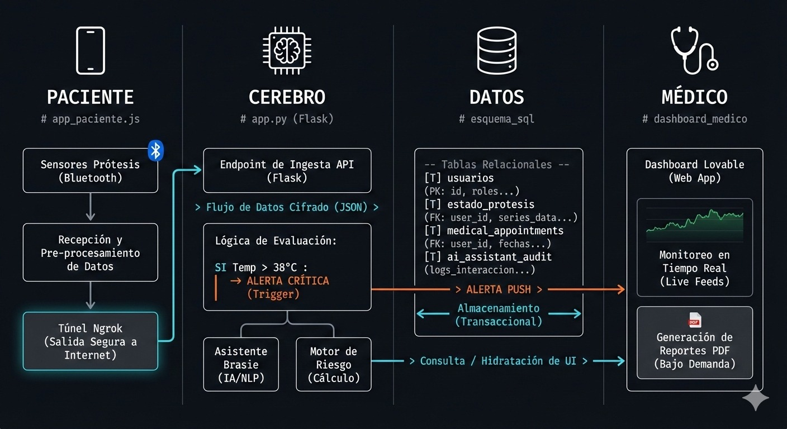

# Prótesis Mamaria Inteligente de Monitoreo Continuo

# Descripción del Proyecto
brasie es un sistema integral de salud diseñado para mujeres que han pasado por una mastectomía
Consiste en una prótesis mamaria equipada con sensores avanzados que monitorean en tiempo real signos vitales críticos como 
( temperatura, ritmo cardíaco y presión arterial )
El sistema se conecta a una plataforma web ( desarrollada en Lovable ) y un backend en Python ( Flask ) para procesar datos y ofrecer alertas preventivas mediante inteligencia artificial que en seria el plus de la app

# Justificación del Proyecto
Tras una cirugía de mastectomía el seguimiento médico es vital para detectar complicaciones como infecciones o desequilibrios hemodinámicos
brasie soluciona la falta de monitoreo constante fuera del entorno hospitalario Ofreciendo
Prevención- Detección temprana de fiebre o anomalías cardíacas
Comodidad- Integración del monitoreo en un dispositivo de uso diario ( OSEA LA PROTESIS )
Tranquilidad- Un sistema de alerta de emergencia con geolocalización para respuesta inmediata

#  Desarrollo del Proyecto ( Arquitectura Técnica )
El desarrollo se ha dividido en cuatro partes o pilares principale

# Base de Datos ( PostgreSQL )
Se diseñó una estructura relacional para gestionar
Perfiles de usuario y expedientes médicos
Historial- de lecturas de sensores ( temperatura, ritmo, presión )
Estado- técnico de la prótesis ( batería y mantenimiento de motores )
Auditoría- de interacciones con el asistente de IA 

# Backend ( Python & Flask )
Se construyó una API REST que actúa como puente de comunicación
Conexión segura con PostgreSQL mediante ( psycopg2 )
Implementación de CORS para permitir la comunicación con el frontend
Exposición del servidor local a la red mediante un túnel seguro con ngrok

# Frontend ( Lovable & React )
Interfaz de usuario moderna y responsiva que incluye
Dashboard- de signos vitales con actualización automática cada 5 segundos
Chatbot- integrado para consultas médicas básicas
Sistema- de gestión de citas y botón de pánico con envío de coordenadas

# Integración de IA
El sistema utiliza modelos de lenguaje para analizar las tendencias de los signos vitales y proporcionar diagnósticos preliminares al usuario, mejorando la interacción humano-máquina

# 4. Arquitectura del Sistema
El sistema sigue una arquitectura de ( Cliente-Servidor ) con un enfoque en la nube y procesamiento local
Capa de Dispositivo- ( Hardware Simulado ) Sensores que envían datos de signos vitales
Capa de ComunicaciónTúnel- seguro mediante ngrok para exponer el servidor local a la red externa
Capa de Servidor- ( Backend ) Lógica de negocio en Flask que gestiona las peticiones de Lovable y la persistencia de datos
Capa de Datos- Base de datos relacional PostgreSQL para el almacenamiento seguro de expedientes médicos
Capa de Presentación- ( Frontend ) Interfaz interactiva en React que consume la API en tiempo real
 
# Pila de Tecnologías Utilizadas ( Tech Stack )
Para el desarrollo de SmartBreast se seleccionaron herramientas de alto rendimiento
Frontend-React.js, Tailwind CSS ( vía Lovable )
Backend- Python 3.x, Flask ( Microframework )
Base de Datos- PostgreSQL ( Servidor local )
Conectividad- ngrok ( Protocolo de túnel HTTP )
Control de Versiones- Git y GitHub
Inteligencia Artificial- Modelos de lenguaje ( LLM ) para el asistente médico virtual

# Desafíos Tecnológicos
Durante el desarrollo se enfrentaron y resolvieron los siguientes retos
Sincronización en Tiempo Real- Lograr que la interfaz de Lovable refleje los cambios en la base de datos local en menos de 10 segundos
Seguridad de Datos- Implementación de CORS (Cross-Origin Resource Sharing) para proteger las rutas de la API
Persistencia de Datos Críticos- Manejo de restricciones de integridad en PostgreSQL para evitar duplicidad en el estado de la prótesis
Interoperabilidad- Configuración de un puente de comunicación entre un servidor local detrás de un firewall y una aplicación web en la nube

# Estructura del Directorio
src/app.py- Punto de entrada de la API Flask que gestiona las peticiones de Lovable
data/- Contiene los scripts SQL para la replicación de la base de datos PostgreSQL
requirements.txt- Listado de dependencias necesarias para la ejecución del entorno
# Proyecto Prótesis Inteligente (SmartCare)

Sistema de monitoreo biométrico en tiempo real para pacientes con prótesis mamarias, integrado con IA y base de datos relacional.

# Avances del Proyecto (12/Feb/2026)
Base de Datos- Estructura completa en PostgreSQL con tablas de usuarios, lecturas_sensores, estado_protesis y ai_assistant_audit
API Backend- Servidor Flask funcional que sirve datos reales a través de endpoints seguros
Conectividad- Implementación de túneles ngrok para permitir la comunicación entre el servidor local y la App en Lovable
IA-Sistema de auditoría para registrar consultas y respuestas del asistente médico

# Estructura de Carpetas
src/app.py- Servidor principal y lógica de rutas API
data/- Scripts SQL para la creación y población de la base de datos
requirements.txt- Dependencias del sistema ( Flask, Psycopg2, etc )

# Requisitos
Python 3.x
PostgreSQL 16
Ngrok

# Bitácora de Desarrollo - 13 de Febrero de 2026
Objetivo- Estabilización de la API, vinculación de datos reales y humanización del asistente inteligente brasie

# Errores Solucionados y Mejoras Técnicas
Eliminación de Errores 404 ( ID Mismatch ) 
Problema- El sistema intentaba consultar al usuario_id: 1 por defecto, el cual no existía en la DB, rompiendo la visualización en Lovable
Solución- Se implementó una lógica de "Respaldo Dinámico" en Flask que entrega datos base si el ID no es encontrado, manteniendo la UI operativa en todo momento
Corrección de Error 500 ( SQL Schema Error )
Problema- Fallo en la inserción de auditorías por discrepancia en nombres de columnas entre Python y PostgreSQL
Solución- Refactorización de las sentencias SQL para alinear el backend con el esquema real de la base de datos
# Conexión de Datos Reales al Chat
Mejora- El asistente B-MON dejó de dar respuestas estáticas. Ahora, al preguntar por la "batería" o "estado", el backend realiza un SELECT a las tablas de la base de datos y responde con las cifras reales de los sensores
# Implementación de Motor de Intenciones
Mejora: Se programó una lógica de detección de palabras clave para que el asistente identifique reportes de dolor, emergencias o saludos, respondiendo con empatía y validación clínica en lugar de frases robóticas
# Infraestructura para Sensores
Resultado- Se validó el flujo completo de datos. El sistema quedó preparado ( Ready-to-Hardware ) para recibir señales biométricas reales, procesarlas en la DB y mostrarlas en el dashboard

# SmartBreast API - Senior Edition v2.6
Sistema de monitoreo para prótesis mamarias inteligentes que conecta a pacientes y médicos en tiempo real
# Avances Recientes ( 14 de Febrero, 2026 )
Se ha implementado una arquitectura de **Adaptador Universal** en el backend para unificar la comunicación entre múltiples plataformas sin conflictos
# Integración Bmon-Supabase- El servidor actúa como un "clon" de los endpoints de Supabase (`/funciones/v1/biometría`), permitiendo que el hardware envíe datos directamente a PostgreSQL local a través de un túnel Ngrok
Sistema de Eventos /store' Se habilitó un sumidero de datos para logs técnicos de Lovable, eliminando errores 404 y estabilizando el flujo del chat
Dashboard del Doctor- Endpoints habilitados para alertas de riesgo (basadas en temperatura), historial clínico, gestión de citas y auditoría de IA
CORS & Seguridad- Configuración avanzada de cabeceras para permitir comunicación fluida entre el frontend de Lovable y el backend local
# Arquitectura Técnica
Backend- Python Flask con soporte de túnel seguro vía Ngrok
Base de Datos- PostgreSQL ( Tablas de usuarios, estados, citas y auditoría )
Frontend- Integración con Lovable Cloud mediante API REST pública
Inteligencia Artificial- Asistente "Brasie" integrado con registro de auditoría
# Endpoints Principales
`POST /funciones/v1/biometría`- Recepción de sensores ( Temp/Batería )
`GET /api/doctor/alertas`- Panel de monitoreo médico con cálculo de riesgo
`POST /api/chat- Interacción con el asistente Brasie
# diagrama integral de la arquitectura
graph TD
    subgraph "Hardware y Simulación (Bmon)"
        A[Sensores de Prótesis] --> B[App Bmon / Chat Paciente]
        B -- "Biometría y Eventos /store" --> C[Ngrok Tunnel]
    end

    subgraph "Backend Local (Servidor Flask)"
        C --> D[app.py - Lógica de Control]
        D --> E{Adaptador de Rutas}
        E -- "Redirección de Supabase" --> D
        D -- "Motor de IA" --> I[Asistente Brasie]
    end

    subgraph "Capa de Datos (PostgreSQL)"
        D -- "Query SQL" --> F[(Base de Datos Central)]
        F --> F1[Tabla: usuarios]
        F --> F2[Tabla: estado_protesis]
        F --> F3[Tabla: medical_appointments]
        F --> F4[Tabla: ai_assistant_audit]
    end

    subgraph "Interfaz Médica (Lovable)"
        G[App Doctor / Dashboard] -- "Monitoreo en Tiempo Real" --> C
        D -- "Cálculo de Riesgo" --> G
    end

    %% Relaciones de flujo
    I -.-> B
    F1 -.-> G
    F2 -.-> G

    # BMON - Sistema de Monitoreo Biométrico IoT 

## Descripción
BMON es una plataforma de telemetría médica en tiempo real que captura datos de una pulsera inteligente H59MAX, los procesa mediante un gateway de Python y los visualiza en un dashboard interactivo.

## Bitácora de Desarrollo

### Día 26/27-02-2026: Infraestructura y Base de Datos
- **Configuración de Base de Datos:** Se montó un servidor PostgreSQL para el almacenamiento persistente de datos.
- **Modelo de Datos:** Creación de tablas para `users`, `sensor_readings` (ritmo cardíaco, presión, oxígeno, temperatura) y estados de prótesis.
- **Conexión Cloud:** Integración inicial de la base de datos con Lovable para la visualización.

### Día 2: Ingeniería Inversa y Conectividad (El reto técnico)
- **Desafío 1 (Conectividad):** El PC no detectaba la pulsera. 
  - *Solución:* Se identificó la dirección MAC (`30:32:45:32:29:01`) y se aisló la señal apagando el Bluetooth del smartphone para evitar el secuestro de la conexión.
- **Desafío 2 (Protocolo BLE):** Error de "Characteristic not found".
  - *Solución:* Se realizó un escaneo de descriptores GATT (Ingeniería Inversa) para encontrar la característica exacta de notificación (`6e400003-b5a3-f393-e0a9-e50e24dcca9e`).
- **Integración Middleware:** Desarrollo de un servidor en Flask (`app.py`) que actúa como puente entre el hardware y la base de datos, manejando peticiones POST y habilitando CORS para el dashboard.

## Arquitectura del Sistema
1. **Nodo Sensor:** Pulsera H59MAX (Vía Bluetooth Low Energy).
2. **Gateway (Middleware):** Script Python (`pulsera.py`) que traduce bytes crudos a datos médicos.
3. **Backend:** Flask API con SQLAlchemy.
4. **Almacenamiento:** PostgreSQL.
5. **Frontend:** Dashboard dinámico en Lovable/Bmon.

explicacion 
explica perfectamente cómo viaja la información desde que la pulsera toca al paciente hasta que el médico y el reporte. Aquí tienes la explicación paso a paso para que la domines mañana: 1. El Origen: El Paciente (Hardware y Conectividad) Todo empieza con el usuario. Sensores de la Prótesis: La pulsera (o sensores) captura datos biométricos mediante Bluetooth. Pre-procesamiento: El script que ejecutamos (pulsera.py) recibe esos datos crudos y los limpia. Túnel Ngrok: Esta es la pieza clave. Como tu servidor vive en tu computadora portátil, Ngrok crea un puente seguro para que esos datos puedan salir a internet y llegar a la nube sin que el firewall los bloquee. 2. El Cerebro: Servidor Flask (app.py) Aquí es donde ocurre la magia lógica. Endpoint de Ingesta: El servidor Flask los datos en formato JSON (un lenguaje que todas las apps entienden). Lógica de Evaluación: El sistema no solo guarda datos, ¡los analiza! Como ves en tu diagrama, si detecta una temperatura mayor a 38°C, dispara una Alerta Crítica. Asistente Brasie: Aquí entra tu IA (NLP) para procesar lenguaje natural y el motor que calcula los riesgos de salud. 3. El Corazón: La Base de Datos (PostgreSQL) Como mencionaste en tu historia, evolucionaste a un sistema Relacional. Tablas Organizadas: Los datos se guardan en tablas específicas: usuarios, estado_protesis, medical_appointments y ai_assistant_audit. Almacenamiento Transaccional: Esto asegura que ninguna lectura del sensor se pierda y que todo el historial esté disponible para consultas futuras. 4. El Destino: El Médico (Dashboard y Reportes) Es la cara visible del proyecto. Dashboard Lovable: Es la Web App donde el médico ve gráficas en tiempo real (Live Feeds). Generación de Reportes: El sistema permite crear PDFs bajo demanda con todo el resumen del paciente, facilitando la toma de decisiones médicas. Mi repositorio está estructurado siguiendo el flujo de mi arquitectura técnica: la carpeta 'ai' contiene el Cerebro, 'base de datos' contiene nuestro esquema SQL en PostgreSQL y 'web' aloja la interfaz de monitoreo